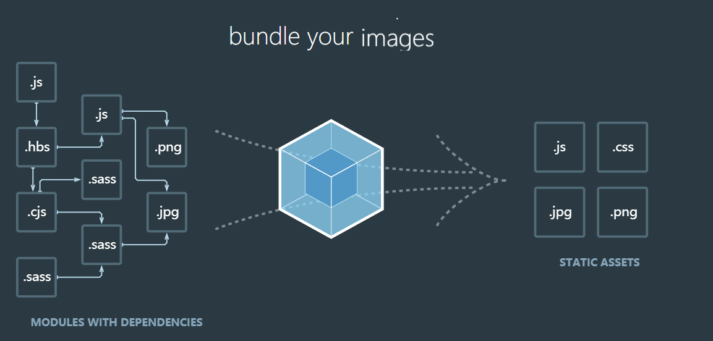

## 关于webpack官网的学习

> webpack，从名词上，“web pack”，大概可以看出是一个网页打包工具，其实它具有打包、压缩、解析编译的功能。



#### 使用（配置webpack.config.js）

entry: 设置入口文件

```js
 entry: {
    main: './src/js/index.ts',
    // test: './test/test.js'
  },
```

resolve: 设置根路径

```js
  resolve: {
    alias: {
      '@': './src'
    },
    extensions: ['.tsx', '.ts', '.js']
  },
```

devServer: 设置热更新

```js
devServer: {
    hot: true,
    port: 5000,
    contentBase: path.join(__dirname, 'dist')
  },
```

module: 设置loader

```js
module: {
    rules: [
      { test: /.txt/, use: 'raw-loader' },
      {
        test: /\.tsx?$/,
        use: 'ts-loader',
        exclude: /node_modules/
      }
    ]
  },
```

plugins: 加载插件

```js
const webpack = require('webpack');
const HtmlWebpackPlugin = require('html-webpack-plugin');
//module.exports
plugins: [
    new webpack.HotModuleReplacementPlugin(),
    new webpack.ProgressPlugin(),
    new HtmlWebpackPlugin({ template: './src/index.html' })
  ],
```

output: 输出目录

```js
output: {
    path: path.resolve(__dirname, 'dist'),
    filename: 'bundle.js'
  }
```

##### 在vue项目中使用webpack


##### 在react项目中使用webpack


#### 怎么写一个loader

[编写一个 loader](https://webpack.docschina.org/contribute/writing-a-loader/)

#### 怎么写一个webpack插件

[编写一个插件](https://webpack.docschina.org/contribute/writing-a-plugin/)

[探寻 webpack 插件机制](https://github.com/frontend9/fe9-library/issues/142)

[webpack原理与实践（二）：实现一个webpack插件](https://github.com/lance10030/articles-and-notes/issues/6)