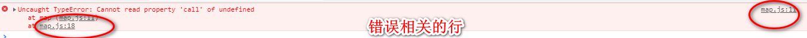
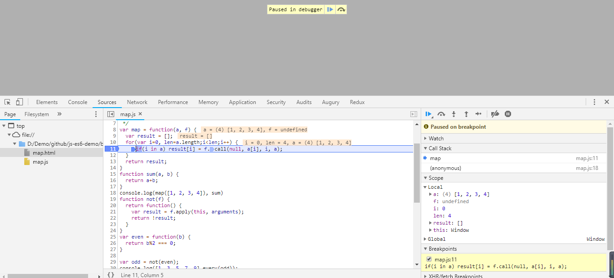

## 聊聊调试的事儿

很多的前端入门新手包括我在内，刚开始都不怎么会使用调试工具，用的比较多的就是console了。

> bug可以说是程序猿的公敌了，所以没有bug是不可能的，有bug也不是什么丢人的事，至少还知道问题在哪，那么接下来就应该debug啦，下面就让我们从浏览器断点调试、代码断点调试、编辑工具断点调试几个方面来聊聊调试的事儿。



### 浏览器断点调试

1.如上图所示，根据报错的位置点进去，到了source，也就是下图所示。

2.在代码左侧打断点后，按F5刷新。

3.鼠标指针放到你要监听的变量，观察值。



### 代码断点调试


1. 在代码里你想debug的地方写debugger

```js
var map = function(a, f) {
  var result = [];
  for(var i=0, len=a.length;i<len;i++) {
    debugger;
    if(i in a) result[i] = f.call(null, a[i], i, a);
  }
  return result;
}
```

2. 在浏览器中就可以自动跳到你打断点的位置了。
3. 鼠标指针放到你要监听的变量，观察值。

### 编辑工具断点调试

因为我使用的是vscode，所以这里以它为例。

1.安装Debugger for Chrome


2. 然后按F5，出现这个框 

   

选择 Chrome

3.然后出现个配置的提示，和打开了launch.json这个文件 

```js
{
      "type": "chrome",
      "request": "attach",
      "name": "Attach to Chrome",
      "port": 9222,
      "webRoot": "${workspaceFolder}"
    },
    {
      "type": "chrome",
      "request": "launch",
      "name": "Launch Chrome",
      "url": "http://localhost:8080",
      "webRoot": "${workspaceFolder}"
    },
    {
      "name": "使用本机 Chrome 调试",
      "type": "chrome",
      "request": "launch",
      "file": "${workspaceRoot}/basic/map.html",
      //  "url": "http://mysite.com/index.html", //使用外部服务器时,请注释掉 file, 改用 url, 并将 useBuildInServer 设置为 false "http://mysite.com/index.html
      "runtimeExecutable": "C:\\Program Files (x86)\\Google\\Chrome\\Application\\chrome.exe", // 改成您的 Chrome 安装路径
      "sourceMaps": true,
      "webRoot": "${workspaceRoot}",
      //  "preLaunchTask":"build",
      "userDataDir": "${tmpdir}",
      "port": 5433
    }
```


4.更改调试方式 


5.在项目的 js 处设置好断点，按 F5，就可以进行断点调试了。 


总而言之，以后还是用第三种+console.log结合使用，开心地debug。